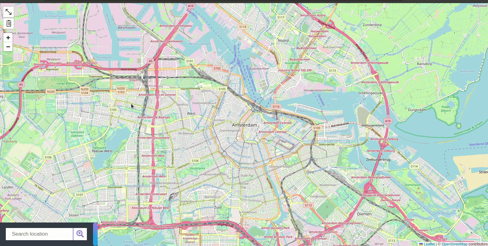
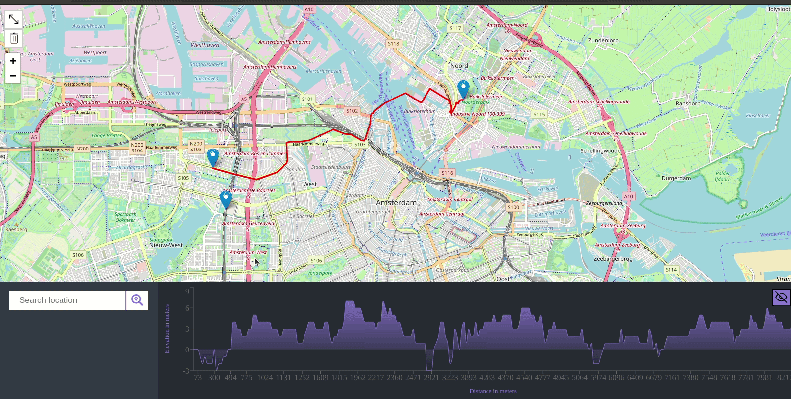

# Bike Router

Live demo: [biker.hasan.one](https://biker.hasan.one/)

This tool will help you plan a cycling route. Simply pick two points on a map and the best path between them will be calculated and displayed on the map.

An elevation chart will also be displayed which will help you visualize the diffeculty of the path. You can click and drag on the chart to calculated the inclination percentage between any two points.

Hovering over the chart will render a marker at the coresponding location on the path.

# Development

To run this tool you will need an API key from [Geoapify Location Platform](https://www.geoapify.com/get-started-with-maps-api). After obtaining the key, put it in an environment variable called `REACT_APP_API_KEY`. You can use [dotenv](https://www.npmjs.com/package/dotenv) package to streamline the process.

This tool was created using [create-react-app](https://create-react-app.dev/) script. You can use the included standard scripts to run, build and test the project. End-to-end tests are a bit long so we have them on a separate script: `yarn e2e`
